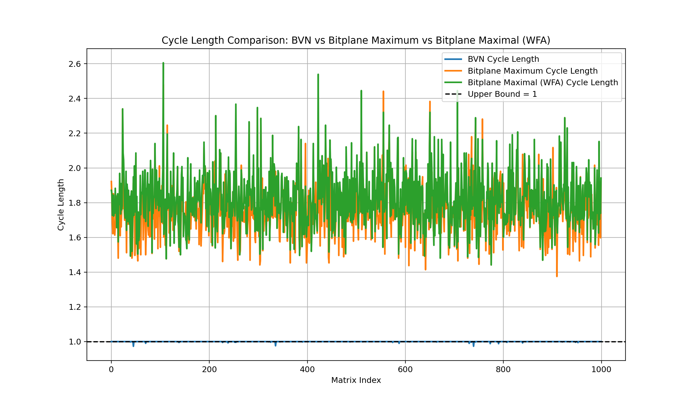
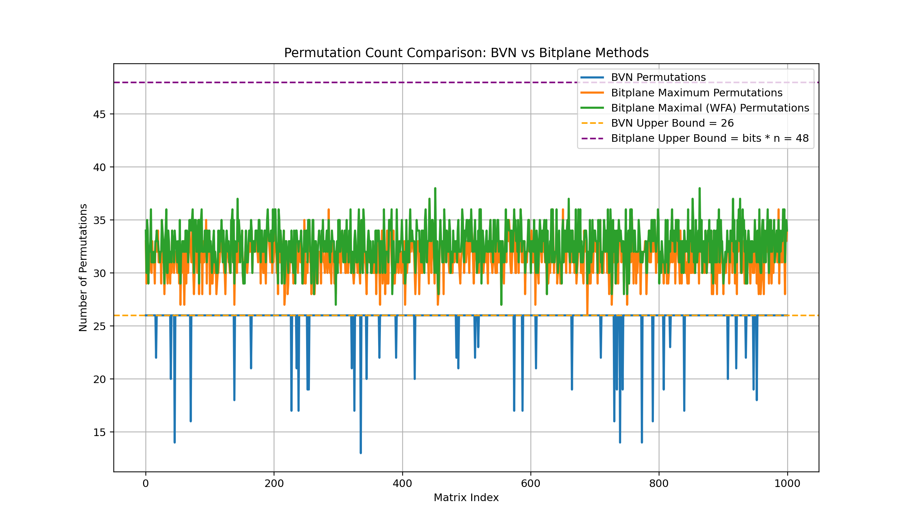
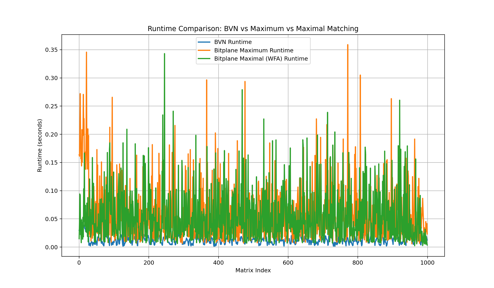

# Birkhoff–von Neumann & Bit-Plane Decomposition Framework

This repository contains a configurable and extensible experimentation framework
for evaluating different matrix-decomposition strategies relevant to
time-slotted optical switching, scheduling, and load-balancing architectures.

For each randomly generated **doubly stochastic matrix**, the framework computes:

- **Birkhoff–von Neumann (BVN) decomposition**
- **Maximum-matching bit-plane decomposition**
- **Maximal-matching bit-plane decomposition (Wavefront Arbiter)**

For every method, we measure:

- **Number of permutations** in the decomposition  
- **Total cycle length** (sum of weights)  
- **Runtime per matrix**

The framework then aggregates stats, logs everything, and produces comparison plots.

---

## 🔧 Features

- Random generation of (sparse) doubly stochastic matrices
- Three decomposition modes:
  - BVN
  - Bit-plane with **maximum matching**
  - Bit-plane with **maximal matching (WFA)**
- For each matrix & method, the framework records:
  - `num_permutations`
  - `cycle_length`
  - `runtime`
- Parallel execution over many matrices using `ThreadPoolExecutor`
- Rich-based logging with per-run directories
- Automatic plot generation (cycle length, **number of permutations**, runtime)

---

## 🧮 Decomposition Methods

### 1. BVN Decomposition
- Iteratively peels permutation matrices from a doubly stochastic matrix.
- Reports:
  - `num_permutations_bvn`
  - `cycle_length_bvn`
  - `runtime_bvn`

### 2. Maximum-Matching Bit-Plane
- Scales the matrix to an integer grid using `bits` (e.g. 8-bit).
- For each bitplane, computes **maximum** bipartite matchings.
- Reports:
  - `num_perm_maximum`
  - `cycle_maximum`
  - `runtime_maximum`

### 3. Maximal-Matching Bit-Plane (Wavefront Arbiter)
- Same bit-plane logic, but uses a **maximal** matching (WFA-style greedy).
- Reports:
  - `num_perm_maximal`
  - `cycle_maximal`
  - `runtime_maximal`

---

## 📊 Outputs & Plots

For a given run, the framework generates:

1. **Cycle Length Plot**
   - BVN vs. maximum bit-plane vs. maximal (WFA) bit-plane
   - Includes theoretical upper bound lines (e.g. `cycle_length <= 1`)

2. **Number of Permutations Plot**
   - BVN vs. maximum bit-plane vs. maximal (WFA) bit-plane  
   - Includes:
     - BVN upper bound: `n² − 2n + 2`
     - Bit-plane upper bound: `bits * n`

3. **Runtime Plot**
   - Per-matrix runtime for:
     - BVN
     - Maximum bit-plane
     - Maximal (WFA) bit-plane

All plots are saved in:

```text
runs/run_YYYYMMDD_HHMMSS/plots/
```

# Directory Structure
```
bvn_project/
│
├── main.py                 # Entry point (CLI + orchestration)
├── src/
│   ├── config.py           # ExperimentConfig dataclass
│   ├── runner.py           # Parallel experiment runner
│   ├── plotting.py         # All plotting functions
│   ├── logging_utils.py    # Logging & run directory utilities
│   ├── algorithms/
│   │   ├── bvn.py                      # BVN decomposition
│   │   ├── wfa.py                      # WFA algorithm
│   │   └── bitplane_maximal.py         # Bit-plane (WFA maximal matching)
│   │   └── bitplane_maximum.py         # Bit-plane (maximum matching)
│   └── utils/
│       ├── matrix_generator.py         # Random doubly stochastic matrices
│       └── stats.py                    # DecompositionStats dataclass
│
├── runs/                   # Auto-created per run
│   └── run_YYYYMMDD_HHMMSS/
│       ├── logs/
│       │   └── experiment.log
│       ├── plots/
│       │   ├── cycle_length_all_methods.png
│       │   ├── permutation_count_all_methods.png
│       │   └── runtime_all_methods.png
│       └── results.csv
│
├── requirements.txt
└── README.md
```
# ⚙ Configuration & CLI

Core configuration is wrapped in ExperimentConfig and can be controlled via CLI:

python main.py \
  --n 6 \
  --num-matrices 1000 \
  --density 1.0 \
  --sinkhorn-iters 200 \
  --bitplane-bits 8 \
  --bitplane-method both \
  --random-seed 42 \
  --max-workers 8 \
  --output-csv runs/my_run/results.csv


Key flag:

--bitplane-method:

maximum – only maximum-matching bit-plane

maximal – only WFA maximal-matching bit-plane

both – compute both maximum & maximal bit-plane decompositions

# 🛠 Installation
python -m venv .venv 

for Linux: source .venv/bin/activate   
for Windows: .venv\Scripts\activate

pip install -r requirements.txt

# 📊 Results
## 1. Cycle Length Comparison

This plot compares the cycle length produced by:
- BVN decomposition
- Bit-plane Maximum Matching
- Bit-plane Maximal Matching (Wavefront Arbiter)

A horizontal dashed line marks the theoretical upper bound:
- cycle length <= 1.0
  


Observations:
- BVN cycle length is always exactly 1.
- Bit-plane maximum is typically close to 1 but may be slightly below due to integer rounding.
- Bit-plane maximal (WFA) tends to undershoot the most.

---

## 2. Number of Permutations

This plot shows the number of permutations generated by:
- BVN
- Bit-plane Maximum
- Bit-plane Maximal (WFA)

Theoretical bounds:
- BVN upper bound: n^2 - 2n + 2
- Bit-plane upper bound: bits * n



Observations:
- BVN stays within its known theoretical upper bound.
- Bit-plane maximum often uses fewer permutations than bit-plane maximal.
- Maximal (WFA) may produce more permutations because maximal matchings are not cardinality-optimal.

---

## 3. Runtime Comparison

This plot shows the per-matrix runtime of:
- BVN decomposition
- Bit-plane maximum matching
- Bit-plane maximal matching (WFA)



Observations:
- BVN is usually the slowest method since it iteratively peels permutation matrices.
- Bit-plane maximum is faster but still requires computing maximum matchings.
- Bit-plane maximal (WFA) is the fastest, consistent with hardware-oriented greedy schedulers.
